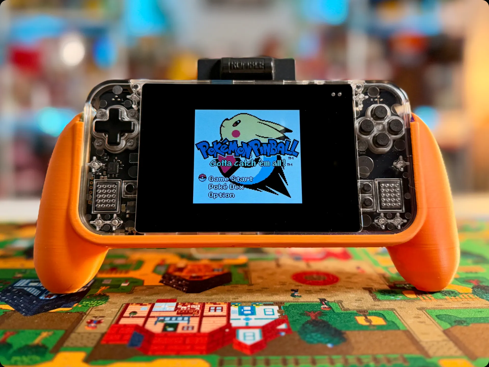

# Accessories

---

## Carrying Cases

### Amazon Hard Case

Soltan_g42 bought this one based on community recommendations and says it works fine.

- **Where to buy:** [Amazon](https://www.amazon.com/dp/B0B1LCPZNP)
- **Source:** [soltan_g42](https://discord.com/channels/1363136046757318927/1466970817954054205/1551698259624329216)

### Anbernic RG 477M Protective Bag

Fits the Game Bub, according to joshuayoungipod.

> "bought this case last week and it came in yesterday. fits the bub perfectly!"

- **Where to buy:** [Anbernic](https://anbernic.com/products/protective-bag-for-rg-477m)
- **Source:** [joshuayoungipod](https://discord.com/channels/1363136046757318927/1466970817954054205/1553054853230493856)

### New 3DS XL Hard Shell (Smatree)

The Game Bub is roughly the same dimensions as a 3DS XL.

- **Where to buy:** [Amazon](https://www.amazon.com/dp/B01N7OGAM5)
- **Sources:** [haxertomb](https://discord.com/channels/1363136046757318927/1466970817954054205/1554302557214613556) · [davedane](https://discord.com/channels/1363136046757318927/1466970817954054205/1554498839766110280)

### AliExpress Hard Shell

Affordable option. Fold the flap down for extra top padding.

- **Where to buy:** [AliExpress](https://www.aliexpress.us/item/3256809721005290.html)
- **Sources:** [absentminded.](https://discord.com/channels/1363136046757318927/1466970817954054205/1553066725027618858) · [forcen](https://discord.com/channels/1363136046757318927/1466970817954054205/1553694255996997642)

### 3D Printed Storage Box

Custom box made from a MakerWorld template, adjusted to Game Bub dimensions plus 1mm tolerance.

- **Where to get the model:** [MakerWorld](https://makerworld.com/en/models/1788161-customizable-storage-box)
- **Source:** [angelicliver](https://discord.com/channels/1363136046757318927/1466970817954054205/1554474783046111252)

### Nintendo DS Drawstring Bag

- **Source:** [thatjon](https://discord.com/channels/1363136046757318927/1466970817954054205/1553951228361310270)

---

## Screen Protectors

The screen is approximately 114mm × 80mm with 2.5mm radius rounded corners. No protector is made specifically for the Game Bub.

### Pre-Made Option

- **AliExpress X20R Glass Protector** — doesn't match the edges perfectly but covers the display area. Underhang is fine since the bezels are large.
  - [Buy here](https://www.aliexpress.us/item/3256812162673273.html)
  - **Sources:** [yadayo](https://discord.com/channels/1363136046757318927/1466970817954054205/1554851010902626415) · [wenwald](https://discord.com/channels/1363136046757318927/1466970817954054205/1554852509049290827)

### Custom Cut Services

| Service | What they do |
|---------|-------------|
| [Hianjoo](https://www.amazon.com/Hianjoo-Protector-295mm×210mm-Anti-scratch-Protective/dp/B0G2C3R5KC) | Buy a sheet, cut it yourself |
| [Photodon](https://www.photodon.com/custom-screen-protector.html) | You send dimensions, they cut and ship |
| [ViaScreens](https://viascreens.com/custom) | You send dimensions, they cut and ship |

**Dimensions to provide:** 114mm × 80mm, 2.5mm radius rounded corners

- **Sources:** [hopemechanic](https://discord.com/channels/1363136046757318927/1466970817954054205/1543468556073832468) · [j_f_c](https://discord.com/channels/1363136046757318927/1466970817954054205/1543692341389566132) · [j_f_c (LCD drawing)](https://discord.com/channels/1363136046757318927/1466970817954054205/1543714431337504799)

---

## 3D Printed Grip

Ergonomic grip by backlogbusters.

- **Model:** [MakerWorld](https://makerworld.com/en/models/3266175-game-bub-grip)
- **Sources:** [backlogbusters](https://discord.com/channels/1363136046757318927/1466970817954054205/1545857348818571394) · [davedane](https://discord.com/channels/1363136046757318927/1466970817954054205/1545875366571155576) · [hyruleking222](https://discord.com/channels/1363136046757318927/1466970817954054205/1547697719215399083)