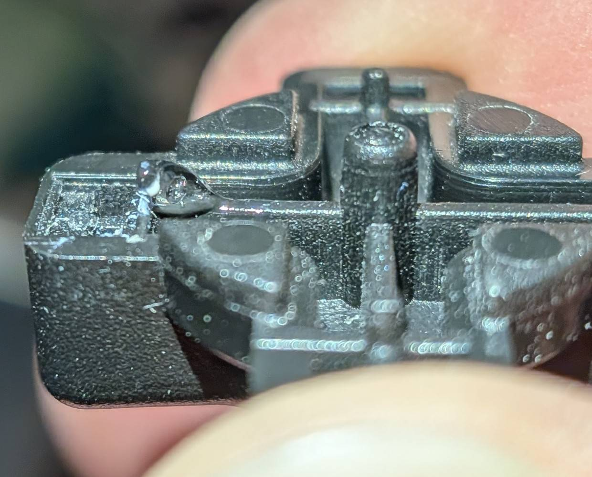
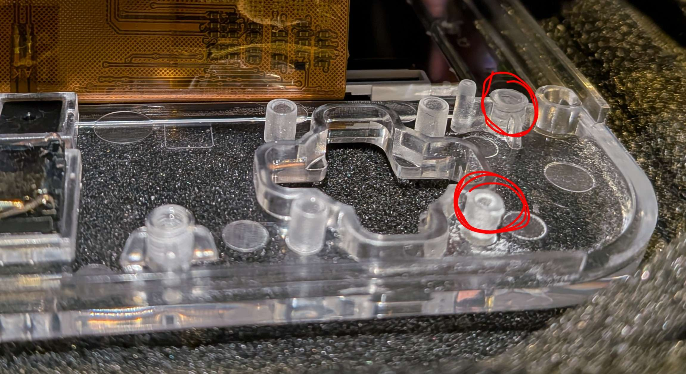
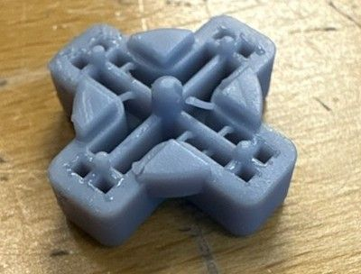
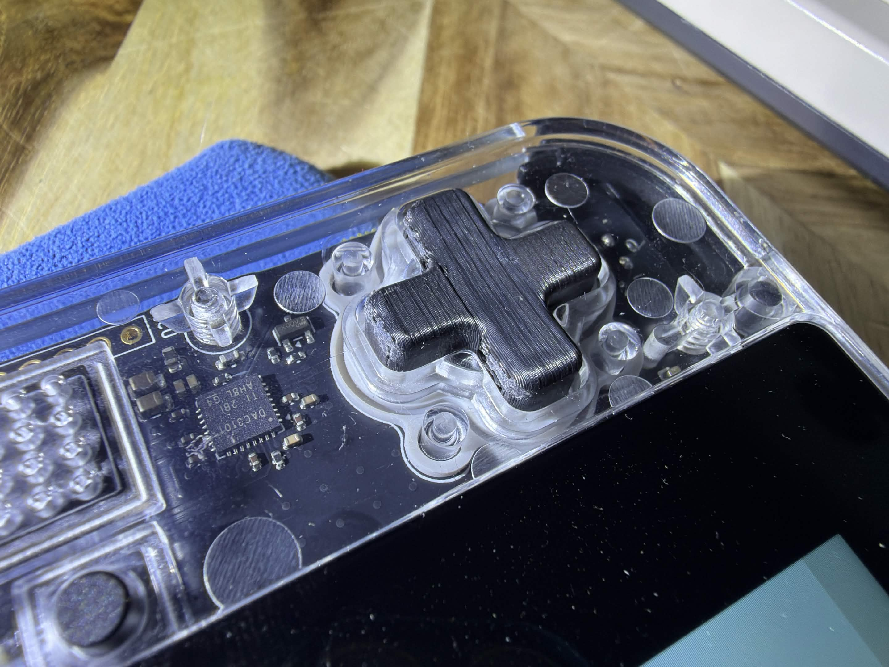
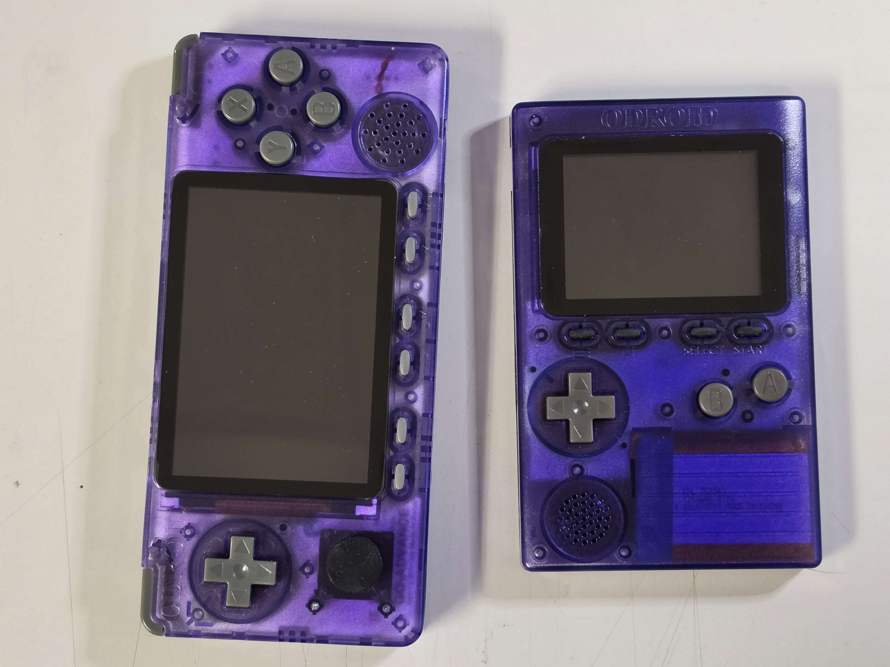

# Mods

---

## Fix D-Pad Responsiveness

The d-pad can feel stiff, diagonals may not register well, or one direction might be less clicky than the others. There are a few different things that can cause this, and a few things people have tried.

### Middle Pivot Peg Too Tall

The center peg on the underside of the d-pad can be too tall. It props the d-pad up so the directional pegs don't fully reach the switches, especially when pressing diagonals. Filing the center peg down a little fixes this.

> "What finally seems to have done the trick was to file down the D-pad's middle post just a little bit." — davedane

- davedane — [initial report](https://discord.com/channels/1363136046757318927/1466970817954054205/1544093109665669121)
- klazo — [confirmed same issue, filed the peg](https://discord.com/channels/1363136046757318927/1466970817954054205/1545263911475880057)
- wavebeam64 — [confirmed the stock dpad doesn't match project STL](https://discord.com/channels/1363136046757318927/1466970817954054205/1547268476375142530)

### Uneven Case Posts

The plastic posts inside the shell that the PCB sits on can be different heights around the d-pad area. This tilts the board so it doesn't make even contact with the d-pad. Check which posts are taller and file them level.

> "For the DIY users I recommend that you try to spot which stems are higher than others instead of just filing down them all." — davedane

- davedane — [instructions and photos](https://discord.com/channels/1363136046757318927/1466970817954054205/1544669281935958109)
- nelson.no — [attempted the trim](https://discord.com/channels/1363136046757318927/1466970817954054205/1544781056555880538)
- eli.eli.eli — originally gave guidance in another channel

### Uneven Actuator Pegs

Some factory d-pads have one actuator peg that's thinner than the other three. That direction feels less responsive and less clicky. Filing won't fix this — the peg itself is physically too short — so the real fix is printing a replacement d-pad from the open source STL.

> "Open source hardware rocks! I can order new 3D printed or resin D-pads from anywhere! (the factory D-pad was faulty)" — davedane

- **STL file:** [button_dpad.stl](https://github.com/gamebub/gamebub-mechanical/blob/main/handheld_rev4/button_dpad.stl)
- davedane — found the thin peg, [ordered resin prints](https://discord.com/channels/1363136046757318927/1466970817954054205/1543904286172512387), [comparison photos](https://discord.com/channels/1363136046757318927/1466970817954054205/1543974068292947988)
- wavebeam64 — [ordered resin prints, confirmed clickiness much better](https://discord.com/channels/1363136046757318927/1466970817954054205/1547040255604035655)
- lag4221 — [confirmed one leg was different on his](https://discord.com/channels/1363136046757318927/1466970817954054205/1545039897948201021)

### Tape as a Temporary Fix

Some people have put thin tape on the d-pad pegs or around the membrane to improve contact without filing anything. It helps at first but wears through with use, so it's not a lasting fix.

> "after enough playtime the tapes beginning to wear through and diagonals are steadily getting harder to input" — klazo

- klazo — [initial experiment with tape](https://discord.com/channels/1363136046757318927/1466970817954054205/1544099293219135518), [tape wearing through](https://discord.com/channels/1363136046757318927/1466970817954054205/1545263911475880057)
- davedane — [tried tape under the middle post, didn't work](https://discord.com/channels/1363136046757318927/1466970817954054205/1544093109665669121)

---

## Button Rattle Silencing / Shoulder Spring Swap

Both of these came from the same post. For rattling buttons (power, volume, start, reset, menu), fold a small piece of paper and place it between the button and the switch — tape the paper to itself so it's easier to position. For the shoulder buttons, swapping in Cherry MX clear switch springs makes them stiffer.

> "If you want to silence the rattling buttons you can fold some paper and put it between the button and the switch. Works perfectly... And for the shoulder buttons the Cherry MX switch spring fits perfectly. Used some to make them more stiff (MX clear)." — .h4xx0r.

- .h4xx0r. — [original report](https://discord.com/channels/1363136046757318927/1466970817954054205/1544421608683212892)

---

## Polycarbonate Spray Paint (Translucent Color)

You can spray the inside of the clear shell with polycarbonate-safe spray paint to get a translucent colored look without any paint feel on the outside, since you're only painting the interior surface. esmith13 used Tamiya PS-45 on Odroid handhelds (also clear plastic shells) with good results — the paint goes on and stays translucent.

> "I made my original Odroid handhelds sort of an atomic purple by removing the shells and taping them off so I could spray the insides of them with Tamiya PS-45 spray paint meant for polycarbonate. It goes on and remains translucent." — esmith13

- esmith13 — [confirmed technique on transparent Odroid handhelds](https://discord.com/channels/1363136046757318927/1466970817954054205/1535344215872118935)